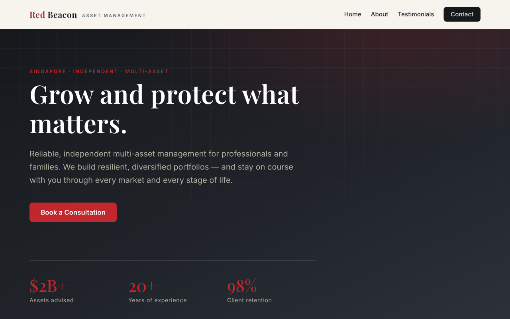

# Red Beacon Asset Management — Website

A single-page marketing and enquiry website for **Red Beacon Asset Management Pte Ltd**, an illustrative Singapore independent multi-asset manager.

🌐 **Live site:** https://isaacloh-afk.github.io/RBAM/



---

## Overview

Built with **vanilla HTML, CSS, and JavaScript** — no frameworks, no build tools, no package manager, no dependencies. The only external resource is Google Fonts, loaded via `<link>`. There is nothing to install or compile.

The page is a single scrollable layout with anchor-linked sections:

- `#home` — hero
- `#services` — what the firm does
- `#about` — firm overview
- `#testimonials` — client testimonials carousel
- `#contact` — enquiry form

## Project structure

| File | Purpose |
| --- | --- |
| `index.html` | All markup — one page, anchor-linked sections. |
| `styles.css` | All styling. Design tokens (colors, spacing, type) live in the `:root` block. |
| `script.js` | All behavior, wrapped in one IIFE — nav, scroll reveals, carousel, form. |
| `favicon.svg` | Brand favicon (beacon mark). |
| `robots.txt` / `sitemap.xml` | SEO crawl directives + sitemap referencing the live URL. |
| `.github/workflows/deploy.yml` | GitHub Actions workflow that deploys to GitHub Pages on push. |

## Run locally

Open directly in a browser:

```bash
open index.html
```

To exercise the enquiry form, serve over HTTP instead (the FormSubmit `fetch()` can be blocked by CORS on `file://`):

```bash
python3 -m http.server   # then visit http://localhost:8000
```

Sanity-check the JS after edits:

```bash
node --check script.js
```

There is no test suite, linter, or build step.

## Key features

- **Design tokens** — all brand colors, spacing, and type are CSS custom properties in `:root`; re-theme by editing those values rather than scattered literals.
- **Scroll reveal** — elements with the `reveal` class fade in via an IntersectionObserver; respects `prefers-reduced-motion`.
- **Testimonials carousel** — data-driven by DOM order; add/remove a `.slide` and the dots, auto-rotate, prev/next, and keyboard arrows adapt automatically.
- **Responsive nav** — sticky navbar collapses to a hamburger menu below 768px.
- **Enquiry form** — client-side validation, honeypot spam protection, and AJAX submission via [FormSubmit](https://formsubmit.co/).
- **WhatsApp chat widget** — floating launcher with suggested-query chips that deep-link to `wa.me` with a prefilled message; the destination number lives in the `WHATSAPP_NUMBER` constant in `script.js`.
- **SEO** — canonical, Open Graph / Twitter Card meta, `FinancialService` JSON-LD, `robots.txt`, and `sitemap.xml`.
- **Social sharing** — dependency-free footer share links (LinkedIn / X / email) using share-intent URLs; no third-party widget scripts.

## Enquiry form

The form POSTs to FormSubmit at `https://formsubmit.co/ajax/<email>`. Note:

- FormSubmit requires **one-time activation**: the first submission to a new address triggers a confirmation email; the form only delivers after that link is clicked.
- A hidden honeypot field silently aborts bot submissions.

## Deployment

Pushing to `main` automatically triggers the GitHub Actions workflow, which builds and publishes the site to GitHub Pages. No manual steps required. The workflow can also be run manually from the repository's **Actions** tab.

---

*This is an illustrative project. Red Beacon Asset Management Pte Ltd is a fictional firm used for demonstration purposes.*
